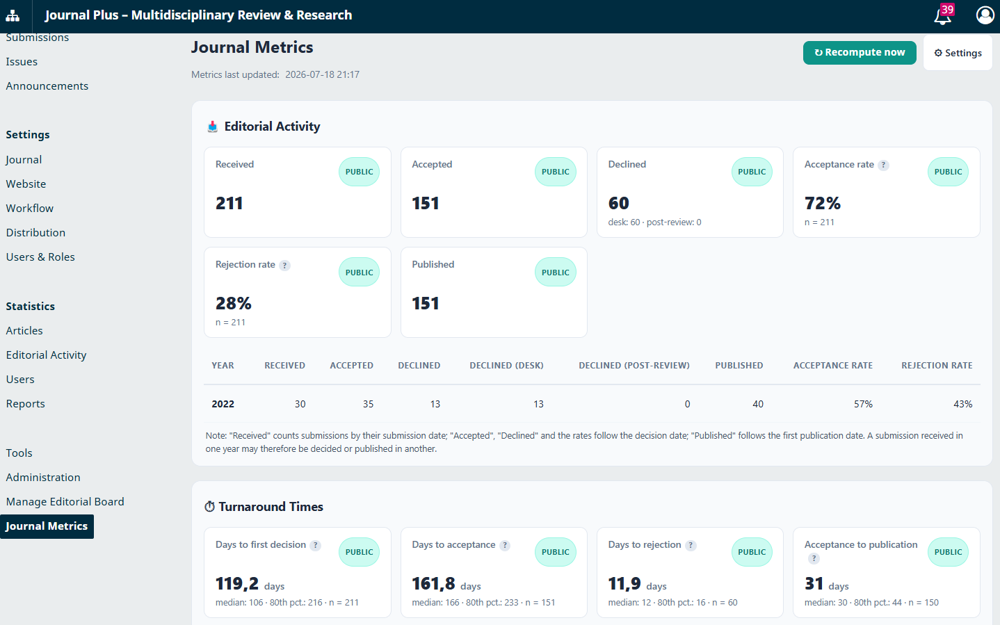
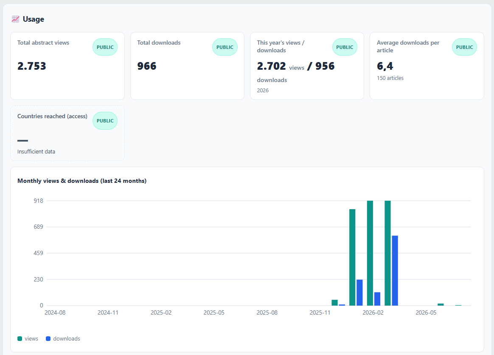
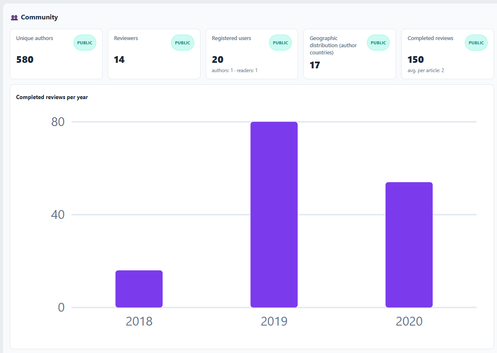
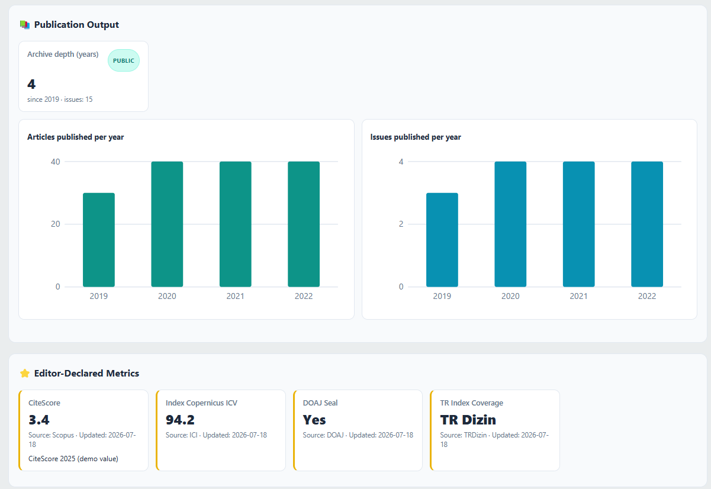
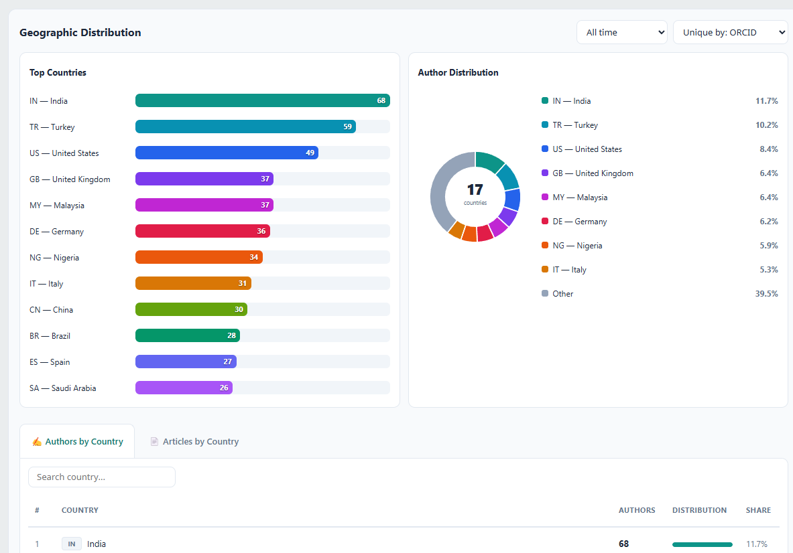
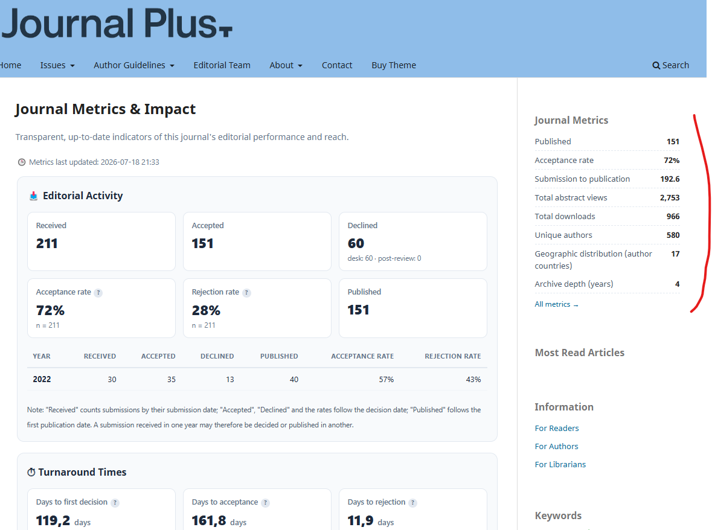
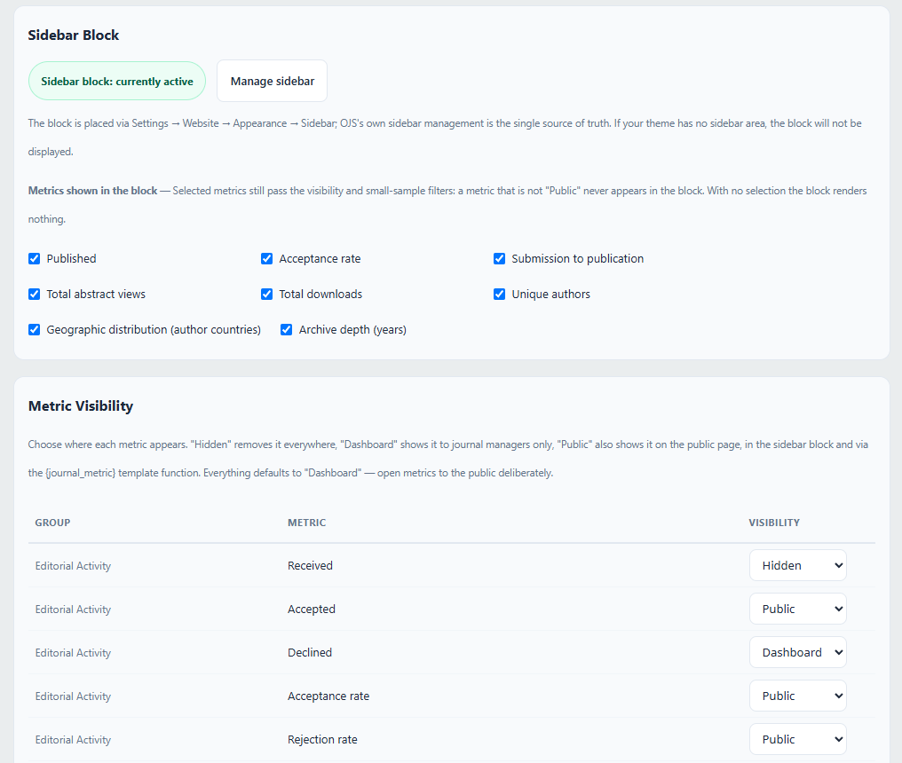

# Journal Metrics for OJS

**Derginiz hakkındaki önemli sayıları — otomatik, şeffaf ve tek sayfada gösterin.**

Journal Metrics, OJS 3.3 kurulumunuzun içinde zaten var olan verileri
profesyonel bir metrik sayfasına dönüştüren bir generic eklentidir: editoryal
etkinlik, süreç süreleri, okunma, topluluk erişimi ve yayın çıktısı. Dergiler
bu sayfayı dizin başvurularını güçlendirmek (DOAJ, Scopus, Web of Science ve
bölgesel dizinler tam olarak bu sayıları ister), yazarlara hakemlik ve yayın
süreleri hakkında gerçekçi beklenti vermek ve okuyucular ile kurumlara
editoryal şeffaflık göstermek için kullanır.

## Neler sunar

- **Yönetici panosu** — tüm metrikler tek bakışta: metrik kartları, yıllık
  tablolar, 24 aylık kullanım eğilimi, en çok okunan makaleler ve grafikli/
  tablolu tam coğrafi dağılım bölümü (yazar/makale ülkeleri).
- **Kamuya açık metrik sayfası** — `/journalmetrics/publicpage` adresinde,
  yalnızca **sizin yayınlamayı seçtiğiniz** metrikleri gösteren, temayla
  uyumlu temiz bir sayfa. Yazdırma dostudur: A4'te düzgün bölünür, dizin
  başvurusuna ek olarak vermeye hazırdır.
- **Kenar çubuğu bloğu** — seçili kamuya açık metrikler derginizin kenar
  çubuğunda.
- **`{journal_metric}` şablon fonksiyonu** — tema geliştiricileri herhangi bir
  kamuya açık metriği istedikleri yere koyabilir:
  `{journal_metric key="submissionsPublished"}`.
- **Gezinme menüsü entegrasyonu** — yerleşik "Dergi Metrikleri" menü öğesi
  türüyle kamu sayfasını istediğiniz menüye ekleyin.
- **Çok dilli** — TR/EN arayüz; kamu sayfası başlığı ve editör beyanı
  metrikler derginin her aktif dili için ayrı değer kabul eder.

## Ekran görüntüleri

**Yönetici panosu**







**Kamuya açık metrik sayfası ve kenar çubuğu bloğu**



**Ayarlar**



## Metrik kataloğu

**Editoryal etkinlik** — alınan, kabul edilen, reddedilen gönderiler
(masa/hakem sonrası kırılımıyla), yayınlanan makaleler, kabul ve ret oranları.
Sayaçlar ve oranlar OJS'nin kendi editoryal istatistik motoruyla hesaplanır;
bu yüzden yerleşik İstatistik ekranlarıyla her zaman aynıdır.
*Kabul oranı* = nihai karar almış gönderiler içinde kabul edilenlerin payı —
OJS'nin kendi kullandığı metodolojinin birebir aynısı.

**Süreç süreleri** — ilk karara, kabule, redde kadar geçen gün; ortalama
hakemlik süresi; kabulden yayına ve gönderiden yayına geçen süre. Her süre
metriği ortalama, medyan, %80 dilimi (makalelerin %80'inin altında kaldığı
değer) ve ölçülen makale sayısıyla birlikte raporlanır — tek bir uç değer
tabloyu asla çarpıtamaz.

**Kullanım** — toplam özet görüntüleme ve dosya indirme, bu yılın rakamları,
makale başına ortalama indirme, en çok okunan on makale ve 24 aylık
görüntüleme/indirme eğilimi; tamamı OJS'nin standart kullanım
istatistiklerinden.

**Topluluk** — benzersiz yazarlar (yapılandırılabilir ORCID → e-posta → ad
soyad benzersizleştirmesiyle), hakemler, kayıtlı kullanıcılar, yıllara göre
tamamlanan hakemlikler ve yazarlarınızın coğrafi dağılımı.

**Yayın çıktısı** — yıllık makale sayısı, yıllık sayı adedi ve arşiv derinliği.

**Editör beyanı metrikler** — OJS'de bulunmayan en fazla beş değer (CiteScore,
dizin kapsamı vb.). Editör ekibi tarafından kaynağıyla girilir, otomatik
metriklerden ayrı gösterilir ve her biri son güncelleme tarihiyle damgalanır.

## Güven üzerine kurulu

- Otomatik değerler **hesaplanır, asla elle değiştirilemez**. Editörler neyin
  gösterilip gizleneceğine karar verir — sayıyı değiştiremez.
- Editör beyanı metrikler otomatik olanlardan görünür biçimde ayrıdır.
- Her kamu sayfasında **"Metriklerin son güncellenmesi"** damgası bulunur;
  her oran ve süre metriği metodolojisini ipucu balonuyla açıklar.
- Küçük örneklemler dürüstçe ele alınır: ayarlanabilir eşiğin altında kayda
  dayanan oran ve süreler, yanıltıcı bir kesinlikle gösterilmek yerine
  bastırılır.
- Kapsam asla sessizce daraltılmaz: dergi, editoryal istatistikleri için bir
  kapsam başlangıç yılı beyan ettiğinde bu kapsam her zaman sayfada, ait
  olduğu sayıların hemen yanında açıkça duyurulur.

## Her tür dergiyle çalışır

- **İş akışını tamamen OJS'de yürüten dergiler** kataloğun tamamını otomatik
  alır — editoryal sayaçlar, oranlar ve tüm süreç süreleri dahil.
- **Makaleleri doğrudan yükleyen dergiler** (XML aktarımı, geçmiş sayı
  yüklemeleri) editoryal grubu gizleyip aynı profesyonel sayfayı kullanım,
  topluluk, çıktı ve editör beyanı metrikleriyle çalıştırır.
- Her metriğin kendi görünürlük anahtarı vardır: **Gizli**, **Pano** (yalnız
  yöneticiler; varsayılan) veya **Kamuya açık**. Editör bilinçli olarak
  açmadıkça hiçbir şey yayınlanmaz.

## Kurulum

1. Web Sitesi Ayarları → Eklentiler → **Yeni Eklenti Yükle** ile
   `journalMetrics-1_0_2_0.tar.gz` dosyasını seçin.
2. Generic Eklentiler altında **Journal Metrics**'i etkinleştirin.
3. Sol yönetim menüsünden **Dergi Metrikleri**'ni açın; hızlı metrik grupları
   ilk ziyarette hesaplanır.
4. **Kurulumdan sonra zamanlanmış görevi bir kez çalıştırın** ki kullanım
   istatistikleri hemen hesaplansın (aksi halde bir sonraki zamanlanmış
   koşuda hesaplanır):

   ```
   php tools/runScheduledTasks.php plugins/generic/journalMetrics/scheduledTasks.xml
   ```

Eklenti kendini Acron eklentisine kaydeder ve snapshot'ını otomatik yeniler
(saatlik koşular, günde bir tam yeniden hesaplama). Büyük kurulumlarda
yukarıdaki komutun gerçek bir cron görevi olarak eklenmesini öneririz.
`config.inc.php` düzenlemesi ve FTP erişimi gerekmez.

## Yapılandırma

Her şey tek ayar sayfasındadır (Dergi Metrikleri → **Ayarlar**): kamu sayfası
anahtarı ve başlığı, metrik bazlı görünürlük matrisi, editör beyanı metrikler,
yazar benzersizleştirme stratejisi, görünüm seçenekleri, küçük örneklem eşiği
ve "Şimdi yeniden hesapla" düğmesi. Kamu sayfasındaki "ojs-services.com
tarafından geliştirilmiştir" bağlantısı da buradan kapatılabilir.

**Editoryal istatistik kapsamı** — birçok dergi OJS'ye yayın hayatının
ortasında geçer: eski ciltler toplu aktarıldığı için başvuru tarihleri ve
editoryal kararlar yalnız son yıllarda mevcuttur. Tam bu durum için ayar
sayfasında bir kapsam başlangıç yılı vardır. Ayarlandığında editoryal
sayaçlar, oranlar, süreç süreleri ve tamamlanan hakem değerlendirmesi
sayıları o yıldan itibaren hesaplanır; yıllık ortalamalar yalnız kapsanan
tam yıllardan alınır ve sayfalar "Editoryal istatistikler {yıl}–günümüz
dönemini kapsar." beyanını son güncelleme damgasının yanında açıkça taşır —
kapsam daraltıldığında bu her zaman sayfada açıkça beyan edilir, asla sessiz
kalınmaz. Kullanım, yayın çıktısı ve topluluk sayıları tüm arşivi saymaya
devam eder.

## Uyumluluk

| | |
|---|---|
| OJS | 3.3.0-x (3.3.0.0 – 3.3.0.22) |
| PHP | 7.4 – 8.1 |
| Veritabanı | MySQL / MariaDB (standart OJS kurulumları) |
| Dergiler | tek ve çok dergili kurulumlar |
| Temalar | her OJS 3.3 temasıyla çalışır — varsayılan veya özel; temalarımız: [ojs-services.com/ojs-themes](https://ojs-services.com/ojs-themes) |
| Eklenti sürümü | 1.0.2.0 |

## Lisans ve destek

GNU GPL v3.

**OJS Services** — [ojs-services.com](https://ojs-services.com) · info@ojs-services.com
